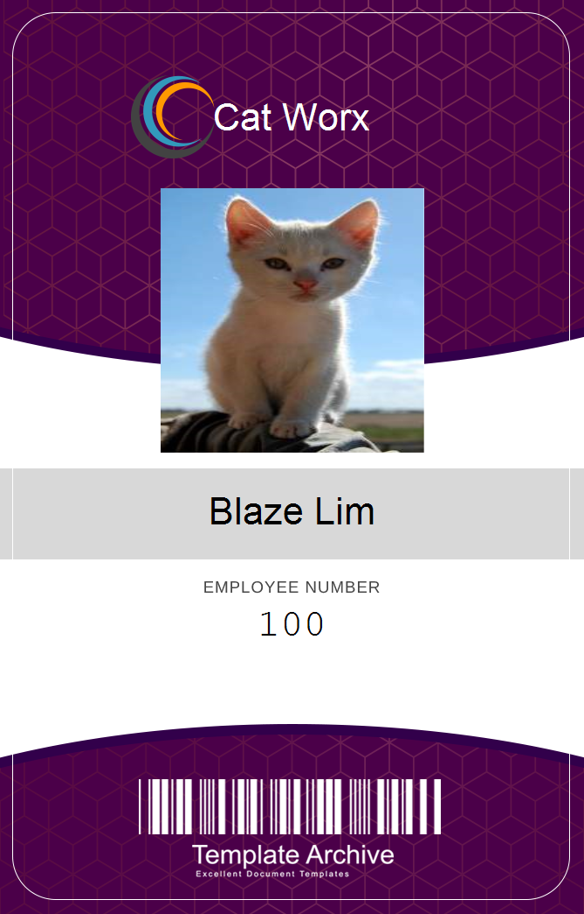

# Catworx

## Description

Procedurally generate badges for your team. Catworx is a badge generator application that lets you quickly create badge png files with a customizable name, employee number, and picture. The picture can be local or from online.
## Table of Contents
* [Installation](#installation)
* [License](#license)
* [Questions](#questions)
## Installation
Simply clone the repo and use 'dotnet run'. Follow the onscreen prompts

## License
This project is covered under the MIT license.
[Click here to see the terms of the license](https://choosealicense.com/licenses/mit/)
## Questions
Any questions or concerns?
Contact me on my github: [blazelim](https://github.com/blazelim/)

Or email me at: blazebentleycolim@gmail.com
